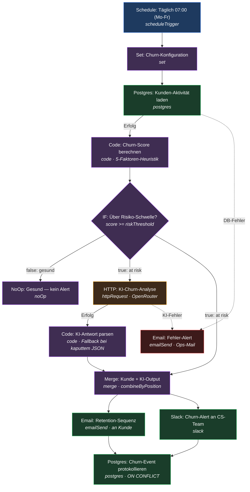

# Churn-Radar — Workflow-Diagramm

Visuelle Übersicht des n8n-Workflows aus `workflow.json`. Zeigt alle Nodes und Verbindungen inkl. Triage-Verzweigung und Error-Pfad.

## Legende

| Farbe | Bedeutung | Nodes |
|---|---|---|
| 🔵 Blau | Trigger | Schedule |
| 🟣 Lila | Logik / Datenverarbeitung | Set, Score-Code, IF-Triage, Parse-Code, Merge, NoOp |
| 🟠 Orange | KI | OpenRouter-Analyse |
| 🟢 Grün | Aktion / I/O | Postgres-Read, Retention-Mail, Slack-Alert, Event-Log |
| 🔴 Rot | Error-Pfad | Fehler-Alert-Mail |

## Ablauf in Worten

1. **Schedule** löst werktäglich morgens aus.
2. **Set** lädt zentrale Konfiguration (Schwellen, Absender, Slack-Channel).
3. **Postgres-Read** holt Kunden + Aktivitätsdaten. Bei DB-Fehler → Error-Pfad (Ops-Mail).
4. **Score-Code** berechnet pro Kunde den Churn-Score und das Risk-Band.
5. **IF-Triage** verzweigt: gesunde Kunden → NoOp (Ende). Risiko-Kunden → KI-Pfad.
6. **OpenRouter** liefert Risiko-Einschätzung + Retention-Mail-Text. Bei Fehler → Error-Pfad.
7. **Parse-Code** liest die KI-Antwort robust aus (Fallback-Template bei kaputtem JSON).
8. **Merge** führt Kundendaten + KI-Output zusammen.
9. **Doppel-Aktion:** Retention-Mail an den Kunden **+** Slack-Alert ans CS-Team.
10. **Postgres-Log** schreibt das Churn-Event (Doppel-Schutz via ON CONFLICT).
