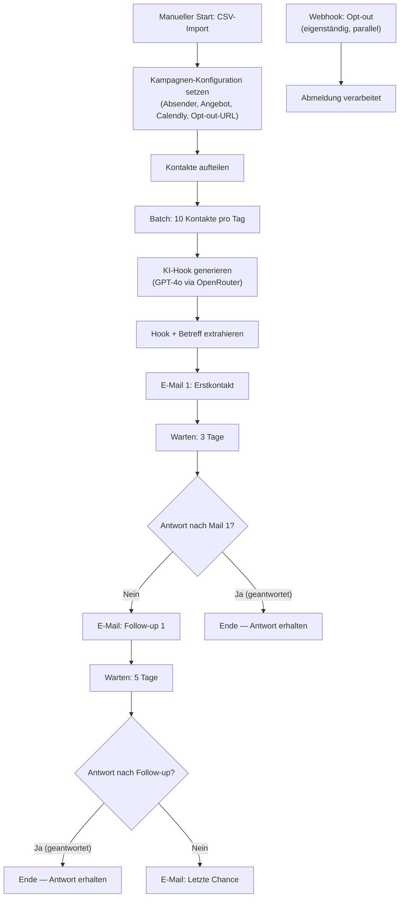

# Cold Outreach System — Ablaufdiagramm

Dieses Diagramm zeigt den kompletten Ablauf des AEVUM Cold-Outreach-Workflows: von der CSV-Importliste über die KI-gestützte Personalisierung bis zur automatischen 3-stufigen E-Mail-Sequenz mit Antwort-Erkennung und integriertem Opt-out.

**So liest du es:** Pfeile zeigen den Datenfluss von Schritt zu Schritt. Die beiden Entscheidungs-Rauten (IF) prüfen jeweils, ob der Kontakt geantwortet hat. Bei "Ja" stoppt die Sequenz für diesen Kontakt (keine weitere Mail). Bei "Nein" läuft sie zur nächsten Stufe weiter. Der Opt-out-Webhook läuft eigenständig und verarbeitet Abmeldungen.

## Knoten-Übersicht

| Schritt | Typ | Funktion |
|---|---|---|
| Manueller Start: CSV-Import | Manual Trigger | Startet die Kampagne |
| Kampagnen-Konfiguration | Set | Absenderdaten, Angebot, Calendly-Link, Opt-out-URL |
| Kontakte aufteilen | Split Out | Wandelt die Kontaktliste in einzelne Datensätze |
| Batch: 10 pro Tag | Split in Batches | Begrenzt auf 10 Kontakte pro Durchlauf (Zustellbarkeit) |
| KI-Hook generieren | HTTP Request | Personalisierter 2-Satz-Hook via GPT-4o |
| Hook extrahieren | Set | Extrahiert Hook + erzeugt Betreffzeile |
| E-Mail 1 | Send Email | Erstkontakt (HTML, mit Opt-out-Link) |
| Warten: 3 Tage | Wait | Pause vor Antwort-Prüfung |
| Antwort nach Mail 1? | IF | Verzweigung je nach Antwortstatus |
| Follow-up 1 | Send Email | Erinnerung, falls keine Antwort |
| Warten: 5 Tage | Wait | Pause vor zweiter Prüfung |
| Antwort nach Follow-up? | IF | Verzweigung je nach Antwortstatus |
| Letzte Chance | Send Email | Abschluss-Mail, falls weiterhin keine Antwort |
| Webhook: Opt-out | Webhook | Eigenständige Verarbeitung von Abmeldungen |
