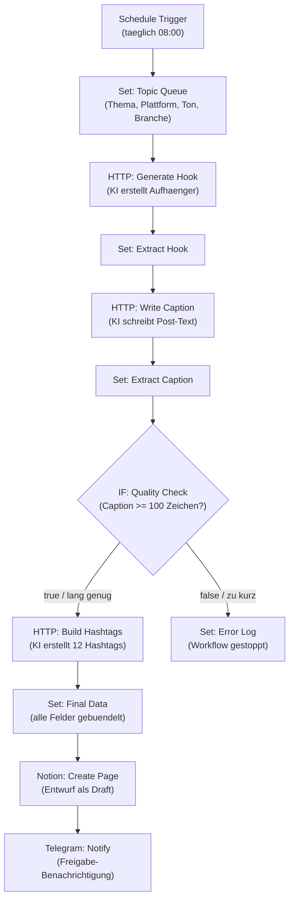

# Content Factory — Workflow-Diagramm

Dieser Workflow erstellt vollautomatisch taeglich einen fertigen Social-Media-Post-Entwurf und legt ihn zur Freigabe ab.

**Ablauf in Kurzform:**
1. Ein Zeitplan startet den Workflow jeden Morgen um 08:00 Uhr.
2. Das Tagesthema wird aus einer Themen-Liste gewaehlt (plus Plattform, Tonalitaet, Branche).
3. Eine KI schreibt einen Hook (Aufhaenger), dann den vollstaendigen Post-Text.
4. Eine Qualitaetspruefung kontrolliert die Mindestlaenge des Textes.
   - Ist der Text lang genug, werden passende Hashtags erzeugt.
   - Ist er zu kurz, stoppt der Workflow mit einem Fehler-Log.
5. Alle Daten werden gebuendelt, als Entwurf in Notion angelegt.
6. Eine Telegram-Nachricht meldet den fertigen Entwurf zur Freigabe.

