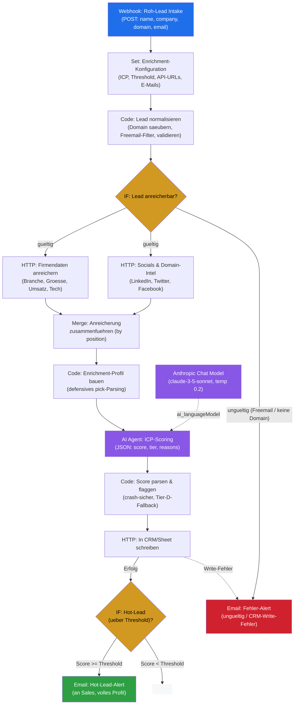

# Lead-Enrichment — Workflow-Diagramm

> Visuelle Darstellung des n8n-Workflows aus `workflow.json` (15 Nodes). Zeigt den vollständigen Datenfluss vom Roh-Lead bis zum Sales-Alert inkl. Fehler-Pfad.

---

## Legende

| Element | Bedeutung |
|---|---|
| 🔵 Blau (Webhook) | Trigger / Eingang des Workflows |
| 🟡 Gelb (Rauten) | Verzweigung (IF-Node) |
| 🟣 Violett (LLM/Agent) | KI-Scoring via Anthropic Claude |
| 🟢 Grün | Erfolgs-Ausgang (Hot-Lead an Sales) |
| 🔴 Rot | Fehler-Ausgang (Alert an Betreiber) |
| `-. ai_languageModel .->` | Cluster-Node-Verbindung: das Sprachmodell hängt am AI-Agent (kein Daten-Hauptpfad) |
| `-.-> Write-Fehler` | Error-Output des CRM-Nodes (`onError: continueErrorOutput`) |

## Flow in Worten

1. **Roh-Lead** kommt per Webhook rein, **Konfiguration** wird angehängt.
2. **Normalisierung** säubert die Domain und filtert Freemail/ungültige Leads → diese gehen direkt in den **Fehler-Alert**.
3. Gültige Leads werden parallel über zwei APIs angereichert (**Firmendaten** + **Socials**) und im **Merge** zusammengeführt.
4. Das **Profil** wird defensiv gebaut (robust gegen leere/uneinheitliche API-Antworten).
5. **Claude** bewertet das Profil gegen das ICP → **Score** wird crash-sicher geparst und geflaggt.
6. Jeder Lead wird ins **CRM** geschrieben; schlägt das fehl, geht ein **Fehler-Alert** raus.
7. Liegt der Score über dem **Threshold** und ist der Lead nicht disqualifiziert, bekommt Sales sofort einen **Hot-Lead-Alert**. Sonst endet der Flow still (Lead ist trotzdem im CRM).
