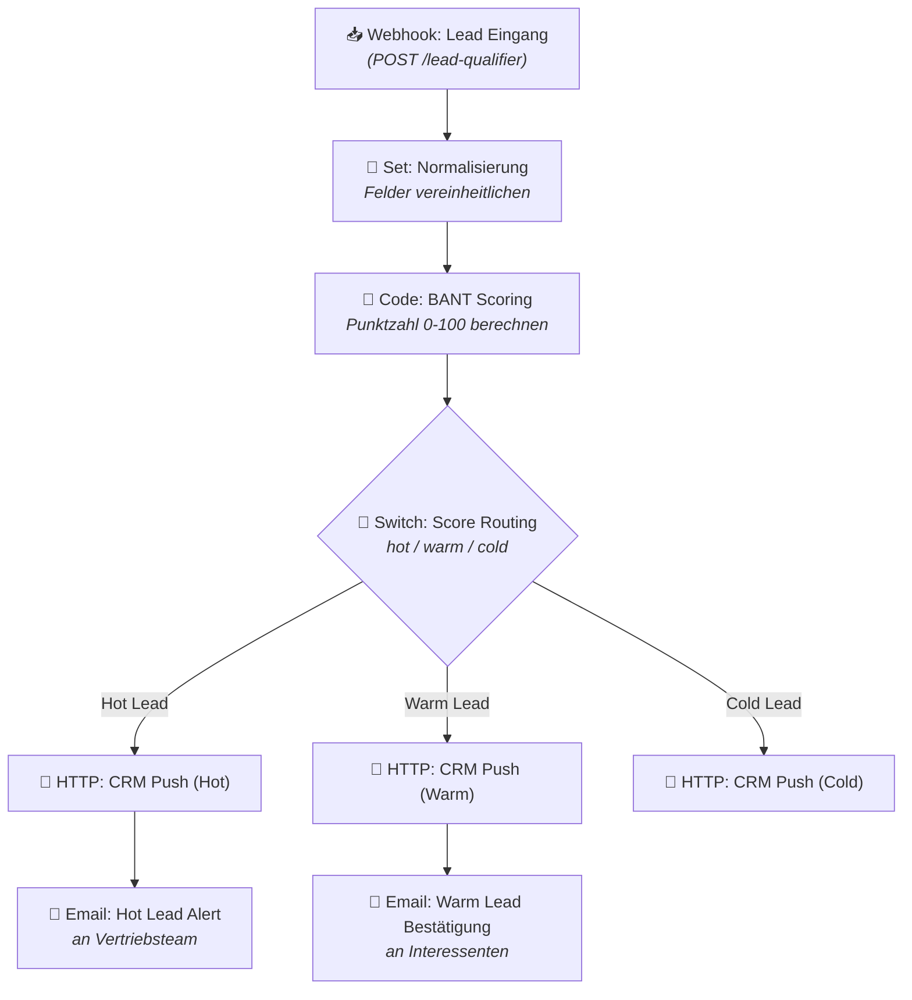

# Lead Qualifier — Workflow-Diagramm

Dieser Blueprint nimmt eingehende Leads (z. B. aus einem Kontaktformular) automatisch entgegen,
vereinheitlicht die Felder, bewertet jeden Lead nach dem **BANT+ Modell** (Budget, Autorität, Bedarf,
Timing + Unternehmensgröße, Branche, Engagement) und leitet ihn je nach Punktzahl unterschiedlich weiter:

- **Hot Lead** (Score ≥ 70): Eintrag ins CRM **und** sofortige E-Mail-Benachrichtigung an das Vertriebsteam.
- **Warm Lead** (Score ≥ 40): Eintrag ins CRM **und** automatische Bestätigungs-E-Mail an den Interessenten.
- **Cold Lead** (Score < 40): Eintrag ins CRM (Archiv), keine weitere Aktion.

Das folgende Diagramm zeigt alle Schritte (Nodes) und ihre Verbindungen:

## Anpassbare Stellen

- **Scoring-Gewichtung & Schwellenwerte** im Node *Code: BANT Scoring* (`weights`, `thresholds`, `targetIndustries`).
- **CRM-Ziel** in den drei *HTTP: CRM Push*-Nodes (aktuell Airtable, URL/Tabelle anpassbar).
- **E-Mail-Empfänger & Texte** in den beiden *Email*-Nodes.
