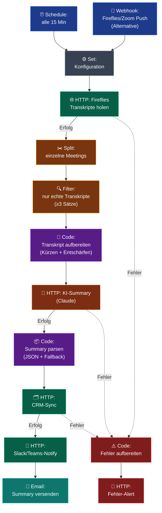

# Meeting-Summarizer — Workflow-Diagramm

Visuelle Darstellung des n8n-Workflows aus `workflow.json` (14 Nodes). Der Flow läuft von Trigger über Transkript-Holen, KI-Summary bis zu den drei Output-Kanälen — mit durchgehendem Fehler-Pfad.

## Legende

| Farbe | Node-Typ | Rolle |
|---|---|---|
| 🔵 Blau | Trigger | Startet den Workflow — Schedule (Polling) **oder** Webhook (Push). Nur einer aktiv. |
| ⚫ Grau | Set | Zentrale Konfiguration (URLs, Empfänger, Modell). |
| 🟢 Grün | HTTP Request | Externe API-Calls: Transkript holen, CRM-Sync, Chat-Notify, Fehler-Alert. |
| 🟠 Orange (Logic) | Split / Filter | Meetings vereinzeln + Müll-Calls aussortieren. |
| 🟣 Lila | Code | Transkript aufbereiten (kürzen/entschärfen) + LLM-Antwort robust parsen. |
| 🟠 Orange (AI) | HTTP → LLM | Claude erzeugt strukturierte Summary (JSON-Schema). |
| 🟦 Türkis | Email | Versendet die HTML-Summary an das Team. |
| 🔴 Rot | Error-Pfad | Gescheiterte HTTP-Schritte (gestrichelte Linien) → Fehler-Aufbereitung → Alert in den errorChannel. |

## Lesehilfe

- **Durchgezogene Linien** = Haupt-/Erfolgs-Pfad.
- **Gestrichelte Linien** = Fehler-Ausgänge (`onError: continueErrorOutput`) der HTTP-Nodes. So bleibt kein still gescheitertes Meeting unbemerkt.
- **Output-Kette** CRM → Notify → Mail läuft sequenziell; nicht benötigte Kanäle lassen sich einzeln deaktivieren.
- **Dedup** (Doppelverarbeitung verhindern) ist im Default nicht enthalten — bei Schedule-Trigger ergänzen oder Webhook-Trigger nutzen (siehe INSTALL-GUIDE Schritt 8).
