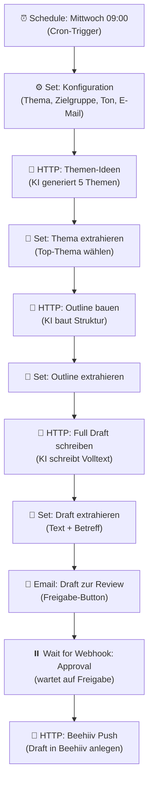

# Newsletter Machine — Workflow-Diagramm

Dieser Workflow erzeugt jede Woche automatisch einen fertigen Newsletter-Entwurf
und legt ihn nach deiner Freigabe direkt als Draft in Beehiiv ab.

**Ablauf in Kurzform:**

1. **Trigger:** Jeden Mittwoch um 09:00 Uhr startet der Workflow automatisch.
2. **Konfiguration:** Deine Einstellungen (Thema, Zielgruppe, Tonfall, Review-E-Mail, Beehiiv-Publication) werden gesetzt.
3. **KI-Ideen:** Eine KI generiert 5 Newsletter-Themenvorschläge.
4. **Thema wählen:** Das erste (Top-)Thema wird ausgewählt.
5. **Outline:** Die KI baut daraus eine Struktur (Betreff, Preview, Abschnitte, Fazit/CTA).
6. **Volltext:** Die KI schreibt den kompletten Newsletter-Text (800–1.200 Wörter).
7. **Review-Mail:** Der Entwurf wird dir per E-Mail mit Freigabe-Button geschickt.
8. **Warten auf Freigabe:** Der Workflow pausiert, bis du auf "Freigeben" klickst (Webhook).
9. **Beehiiv:** Nach Freigabe wird der Newsletter als Draft in Beehiiv erstellt.

Die "Set"-Schritte zwischen den KI-Aufrufen extrahieren jeweils das Ergebnis und reichen
deine Konfiguration weiter, damit jeder Schritt die nötigen Daten hat.

