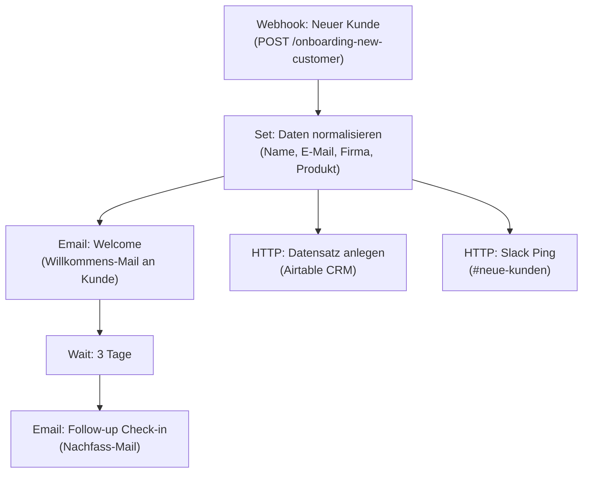

# Onboarding Autopilot — Ablaufdiagramm

Dieser Blueprint automatisiert das Kunden-Onboarding. Sobald ein neuer Kunde
über das Formular/die Webhook-Schnittstelle eingeht, werden die Daten
normalisiert und parallel drei Aktionen ausgelöst: eine Willkommens-Mail an
den Kunden, ein neuer Datensatz im CRM (Airtable) sowie eine Slack-Benachrichtigung
an das interne Team. Drei Tage nach der Willkommens-Mail folgt automatisch eine
Check-in-Mail, die nachfragt, ob alles läuft, und erneut den Kick-off-Termin anbietet.

Das Diagramm zeigt alle Nodes und ihre Verbindungen so, wie sie im Workflow
verschaltet sind.

## Nodes im Überblick

| Node | Typ | Funktion |
|------|-----|----------|
| Webhook: Neuer Kunde | Webhook | Einstiegspunkt, empfängt neue Kundendaten per POST |
| Set: Daten normalisieren | Set | Vereinheitlicht Felder (Vorname/Nachname/E-Mail/Firma/Produkt) und setzt Zeitstempel + Calendly-Link |
| Email: Welcome | Send Email | Versendet die Willkommens-Mail mit nächsten Schritten |
| HTTP: Datensatz anlegen | HTTP Request | Legt den Kunden im Airtable-CRM mit Status „Onboarding" an |
| HTTP: Slack Ping | HTTP Request | Benachrichtigt das Team im Slack-Channel |
| Wait: 3 Tage | Wait | Pausiert den Ablauf für 3 Tage |
| Email: Follow-up Check-in | Send Email | Versendet die automatische Nachfass-Mail |
