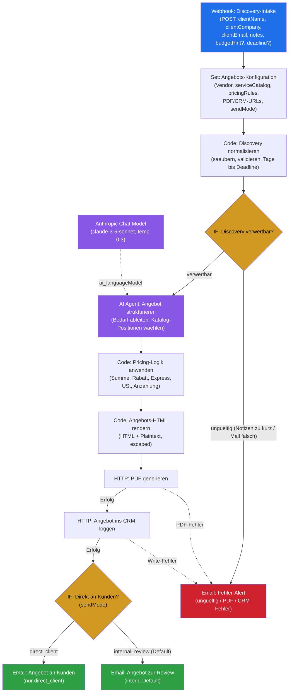

# Proposal-Generator — Workflow-Diagramm

> Visuelle Darstellung des n8n-Workflows aus `workflow.json` (14 Nodes). Zeigt den vollständigen Datenfluss von den Discovery-Notizen bis zum freigegebenen Angebot inkl. Fehler-Pfad und Versand-Gate.

---

## Legende

| Element | Bedeutung |
|---|---|
| 🔵 Blau (Webhook) | Trigger / Eingang des Workflows |
| 🟡 Gelb (Rauten) | Verzweigung (IF-Node) |
| 🟣 Violett (LLM/Agent) | KI-Strukturierung via Anthropic Claude |
| 🟢 Grün | Erfolgs-Ausgänge (Angebot an Kunden ODER an interne Review) |
| 🔴 Rot | Fehler-Ausgang (Alert an Betreiber) |
| `-. ai_languageModel .->` | Cluster-Node-Verbindung: das Sprachmodell hängt am AI-Agent (kein Daten-Hauptpfad) |
| `-.-> Fehler` | Error-Output des Nodes (`onError: continueErrorOutput`) |

## Flow in Worten

1. **Discovery-Notizen** kommen per Webhook rein, die **Konfiguration** (Katalog, Pricing-Regeln, Vendor-Daten) wird angehängt.
2. **Normalisierung** säubert + validiert den Input und berechnet Tage bis Deadline. Ungültige Discovery (zu kurze Notizen, falsche Mail) geht direkt in den **Fehler-Alert** — es wird kein Angebot erstellt.
3. **Claude** liest die Notizen, leitet die Bedürfnisse ab und wählt **ausschließlich Positionen aus dem Leistungskatalog** (keine erfundenen Leistungen/Preise).
4. Die **Pricing-Logik** rechnet deterministisch (Code, kein LLM): Zwischensumme, Mengenrabatt, Express-Zuschlag bei knapper Deadline, USt, Anzahlung — plus Budget-Warnung.
5. Das **Angebots-HTML** wird sauber gerendert (alle dynamischen Felder escaped) und an die **PDF-API** geschickt.
6. Jedes Angebot wird mit Metadaten ins **CRM** geloggt. Schlägt PDF oder CRM fehl, geht ein **Fehler-Alert** raus (kein stiller Tod).
7. Das **Versand-Gate** entscheidet: bei `direct_client` geht das Angebot an den Kunden, im Default `internal_review` zuerst zur menschlichen Freigabe ins interne Postfach.
