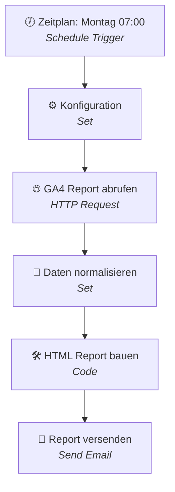

# Reporting Dashboard — Ablaufdiagramm

Dieser Workflow erstellt jede Woche automatisch einen Marketing-Report aus Google Analytics 4 (GA4) und verschickt ihn per E-Mail.

So läuft er Schritt für Schritt ab:

1. **Zeitplan (Montag 07:00 Uhr)** — Der Workflow startet automatisch jeden Montagmorgen.
2. **Konfiguration** — Lädt die Einstellungen: GA4-Property, Empfänger-Adressen, Report-Titel, Währung und den auszuwertenden Zeitraum (letzte 7 Tage inkl. Vergleichswoche).
3. **GA4-Report abrufen** — Holt die Kennzahlen direkt von Google Analytics (Sitzungen, Conversions, Absprungrate, Sitzungsdauer, Top-Seiten) inklusive Vergleich zur Vorwoche.
4. **Daten aufbereiten** — Bringt die Rohdaten von Google in eine saubere, einheitliche Form.
5. **HTML-Report bauen** — Erzeugt einen optisch ansprechenden E-Mail-Report mit KPI-Kacheln, Veränderungen zur Vorwoche, einer Status-Ampel (Gut / Beobachten / Handlungsbedarf) und den Top-5-Seiten.
6. **Report versenden** — Schickt den fertigen Report per E-Mail an die definierten Empfänger.

