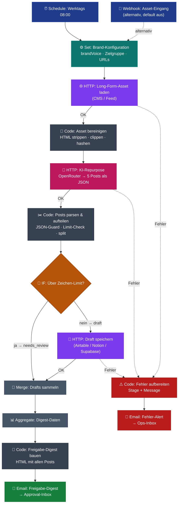

# Social-Repurpose — Workflow-Diagramm

Visualisierung des n8n-Workflows (`workflow.json`, 15 Nodes). Ein Long-Form-Asset wird zu 5+ plattformspezifischen Posts, validiert, gespeichert und als Freigabe-Digest versendet — mit durchgehendem Fehler-Pfad.

---

## Legende

| Farbe | Node-Typ | Funktion |
|---|---|---|
| 🔵 Blau | Trigger | Schedule (werktags 08:00) oder optionaler Webhook-Push |
| 🟢 Türkis | Config | Brand-Voice, Zielgruppe, URLs, Mail-Adressen |
| 🟣 Violett | HTTP | Externe Calls: Asset laden, Draft speichern |
| 🌸 Magenta | LLM | OpenRouter-Repurpose (5 Posts aus 1 Call) |
| ⚫ Grau-dunkel | Code | Bereinigen, Parsen/Splitten, Digest-Bau, Fehler-Aufbereitung |
| 🟠 Orange | Decision | Plattform-Zeichenlimit-Check |
| 🔘 Grau | Util | Merge + Aggregate (Posts wieder zusammenführen) |
| 🟢 Grün | Output | Freigabe-Digest-Mail |
| 🔴 Rot | Error | Fehler-Pfad → Alert-Mail |

## Flow in Worten

1. **Trigger** feuert werktags 08:00 (oder per Webhook beim Veröffentlichen).
2. **Brand-Konfiguration** liefert Voice, Zielgruppe und alle Ziel-URLs.
3. **Asset laden** holt das neueste Long-Form-Asset aus dem CMS/Feed. Schlägt das fehl → Fehler-Pfad.
4. **Bereinigen** strippt HTML, kürzt auf token-sicheres Budget, bildet einen `assetHash`.
5. **KI-Repurpose** erzeugt in einem OpenRouter-Call 5 Posts (LinkedIn-Text, 2 Tweets, Instagram-Caption, Carousel-Outline) als JSON. Schlägt das fehl → Fehler-Pfad.
6. **Parsen & Aufteilen** validiert das JSON, splittet jeden Post in ein eigenes Item, prüft Zeichenlimits.
7. **Limit-Check:** Posts über dem Plattform-Limit gehen als `needs_review` direkt in den Merge; saubere Posts werden gespeichert.
8. **Draft speichern** schreibt jeden sauberen Post in den Draft-Store. Schlägt das fehl → Fehler-Pfad.
9. **Merge + Aggregate** führen alle Posts wieder zu einem Stream zusammen.
10. **Digest bauen + Mail** versendet eine HTML-Übersicht aller Posts an die Approval-Inbox — **keine automatische Veröffentlichung**, der Mensch gibt frei.
11. **Fehler-Pfad** fängt Fetch-, LLM- und Store-Fehler ab und schickt eine Alert-Mail mit Stufen-Info statt halben Output zu produzieren.
