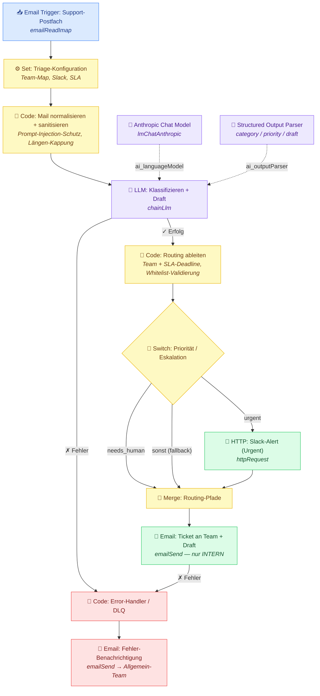

# Support-Triage — Workflow-Diagramm

Visualisierung des n8n-Workflows aus `workflow.json`. Zeigt alle 13 Nodes, den Haupt-Flow, die KI-Sub-Nodes, das Prioritäts-Routing und den Error-/Dead-Letter-Pfad.

## Legende

| Farbe | Bedeutung |
|---|---|
| 🔵 Blau | Trigger (Eingang aus dem Support-Postfach) |
| 🟣 Violett | KI-Verarbeitung (Anthropic-Modell + LLM-Chain + strukturierter Output-Parser) |
| 🟡 Gelb | Logik (Konfiguration, Sanitisierung, Routing, Verzweigung, Merge) |
| 🟢 Grün | Output (Slack-Alert + interne Ticket-Mail mit Antwort-Entwurf) |
| 🔴 Rot | Error-Pfad / Dead-Letter (Fehler-Sammler + Benachrichtigung) |

## Flow in Worten

1. Eine Mail trifft im **Support-Postfach** ein und löst den Workflow aus.
2. Die **Konfiguration** (Team-Map, Slack-Channels, SLA) wird geladen.
3. Die Mail wird **normalisiert und gegen Prompt-Injection gehärtet** (Steuerzeichen raus, Länge gekappt).
4. **Claude** klassifiziert die Mail (Kategorie, Priorität, Stimmung, Sprache), fasst sie zusammen und erstellt einen **Antwort-Entwurf** — als strukturierter, maschinenlesbarer Output.
5. Aus Kategorie + Priorität werden **Ziel-Team und SLA-Deadline** abgeleitet (mit Whitelist-Validierung).
6. Der **Switch** entscheidet: bei `urgent` zusätzlich ein **Slack-Alert**, bei `needs_human` oder sonst direkt weiter.
7. Alle Pfade laufen im **Merge** zusammen und erzeugen die **interne Ticket-Mail** ans zuständige Team — inklusive Zusammenfassung und Antwort-Entwurf (klar als „vor Versand prüfen" markiert, **kein Auto-Versand an den Kunden**).
8. Schlägt die KI oder der Versand fehl, landet die Mail im **Error-Handler** und löst eine **Fehler-Benachrichtigung** ans Allgemein-Team aus — keine Mail geht still verloren.
