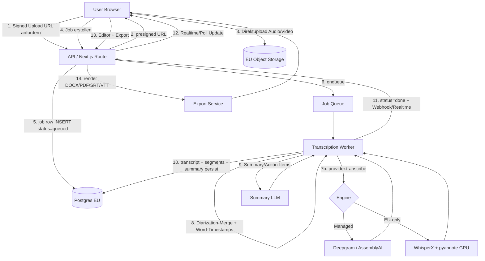

# SPEC — Transcription-SaaS

Technische Architektur. Stand 2026-05-30. Alle genannten APIs/Modelle sind real und recherchiert (Quellen am Ende).

---

## 1. Architektur-Prinzip

Asynchrone Job-Pipeline. Upload trennt sich von Verarbeitung (Transkription kann Minuten dauern). Ein Orchestrator zieht Jobs aus einer Queue, ruft die Speech-Engine + Diarization + Summary-LLM, schreibt strukturierte Ergebnisse zurück. Frontend pollt/abonniert Job-Status.

**Provider-Abstraktion ist Pflicht:** Eine `TranscriptionProvider`-Schnittstelle kapselt die Engine, sodass zwischen Managed-API (günstig, schnell, niedrige Last) und Self-Hosted (EU-only, hohe Last) gewechselt werden kann, ohne den Rest umzubauen. Das ist gleichzeitig USP (EU-Modus) und Kostensteuerung.

---

## 2. Empfohlener Stack

| Layer | Wahl | Begründung |
|---|---|---|
| Frontend | Next.js (App Router) + TypeScript + Tailwind/shadcn | AEVUM-Standard, schnelle self-serve UI |
| Auth | Supabase Auth (E-Mail/Magic-Link, OAuth Google) | bereits im AEVUM-Stack |
| DB | Supabase Postgres (EU-Region, eu-central) | RLS, EU-Datenhaltung |
| Object Storage | Supabase Storage **oder** S3-kompatibel in EU (z. B. Hetzner Object Storage / Scaleway) | Audio bleibt in EU |
| Queue / Jobs | Supabase + Postgres-Job-Table + Worker, **oder** Redis (BullMQ) bei höherem Volumen | einfach starten, später skalieren |
| Worker / API | Node/TypeScript Service (Fastify) auf VPS, GPU-Worker separat | Provider-Orchestrierung |
| Speech-Engine (managed) | **Deepgram Nova-3** (batch 0,0043 $/Min) primär; **AssemblyAI** (built-in Diarization + Summary) als Alternative | Kosten + Diarization inklusive |
| Speech-Engine (EU/self-host) | **WhisperX** (faster-whisper large-v3) + **pyannote.audio 4.0 / Community-1** | EU-only-Modus, Word-Timestamps + Diarization |
| Summary/Intelligence | LLM via API — Claude (Anthropic) oder GPT für Summary/Action-Items; EU-Modus: gehostetes Open-Weight (z. B. Mistral) | strukturierte Zusammenfassung |
| Billing | **Stripe** (Checkout + Customer Portal, usage/credits) | self-serve, no-call |
| Deploy | Vercel (Frontend) + VPS/GPU für Worker | Push→Vercel-Pattern; GPU on-demand |

**Engine-Entscheidungslogik:** Default = Deepgram Nova-3 batch (Diarization + günstigster Per-Min-Preis, ~0,0043 $/Min). Kunden mit "EU-only-Processing"-Flag → WhisperX+pyannote auf EU-GPU. AssemblyAI als Fallback/A-B, weil Diarization + Auto-Summary + PII-Redaction out-of-the-box mitkommen.

---

## 3. Datenfluss

---

## 4. Datenmodell (Kern)

- `users` (Supabase Auth)
- `accounts` — plan, credit_balance_minutes, eu_only_flag, branding
- `transcription_jobs` — id, account_id, source_file_path, media_duration_sec, language, status (`queued|processing|done|error`), engine_used, cost_minutes, created_at, error_msg
- `transcripts` — job_id, full_text, language, word_count
- `segments` — transcript_id, speaker_label, start_ms, end_ms, text (Word-Level optional in JSONB)
- `speakers` — transcript_id, label, display_name (umbenennbar)
- `summaries` — transcript_id, tldr, bullets (jsonb), action_items (jsonb), chapters (jsonb), keywords (jsonb)
- `shares` — transcript_id, token, password_hash, expires_at
- `usage_events` — account_id, minutes, engine, created_at (für Billing/Audit)

RLS: jede Zeile an `account_id` gebunden, kein Cross-Account-Read.

---

## 5. Kern-Endpoints (API)

| Methode | Pfad | Zweck |
|---|---|---|
| POST | `/api/uploads/sign` | presigned Upload-URL (EU-Storage) |
| POST | `/api/jobs` | Job erstellen (file ref, language, options: diarize, summarize, eu_only) |
| GET | `/api/jobs/:id` | Job-Status + Fortschritt |
| GET | `/api/transcripts/:id` | Transkript + Segmente + Speaker |
| PATCH | `/api/transcripts/:id` | Inline-Korrektur, Speaker umbenennen |
| GET | `/api/transcripts/:id/summary` | Summary/Action-Items/Kapitel |
| POST | `/api/transcripts/:id/export` | Export rendern (`format=txt\|docx\|pdf\|srt\|vtt\|json\|md`) |
| POST | `/api/transcripts/:id/share` | Share-Link erzeugen (Passwort, Ablauf) |
| POST | `/api/webhooks/stripe` | Billing-Events (Credits gutschreiben) |
| POST | `/api/webhooks/engine` | (optional) async Callback von Deepgram/AssemblyAI |
| DELETE | `/api/transcripts/:id` | Hard-Delete (DSGVO Löschanspruch) |

---

## 6. MVP-Scope vs. Phase-2

### MVP (zuerst, cash-relevant)
- Upload (Datei-Drag-&-Drop) Audio + Video, EU-Storage
- Transkription DE/EN, managed Engine (Deepgram Nova-3 batch)
- Speaker-Diarization (automatisch, manuell umbenennen)
- KI-Summary: TL;DR + Bullets + Action-Items
- Editor: Player↔Text-Sync, Inline-Edit
- Export: TXT, DOCX, SRT, VTT
- Self-serve Auth + Stripe Credit-Packs + Monatsplan
- DSGVO-Baseline: EU-Storage, Auto-Löschung, AVV-Download

### Phase-2 (nach erster Cash-Validierung)
- **EU-only-Processing-Modus** (WhisperX + pyannote auf eigener EU-GPU) als Premium-Flag
- URL-Import (YouTube, Google Drive, Dropbox)
- Live/Realtime-Transkription (Deepgram Flux / AssemblyAI Streaming WebSocket)
- 50+ Sprachen + Übersetzung
- Auto-Kapitel + Topic-Detection + Keyword-Extraktion (erweitert)
- Team-Workspaces + Rollen
- PII-Redaction (Deepgram/AssemblyAI built-in)
- Custom-Vocabulary / Keyterm-Prompting
- PDF-Export mit Branding, Notion/Markdown-Push
- API für Kunden (programmatischer Zugriff)
- Zapier/Make-Integration

---

## 7. Technische Machbarkeit / Risiken (recherchiert)

- **Diarization-Genauigkeit:** pyannote 3.1 OSS liegt bei ~11–19 % DER; Community-1 (pyannote.audio 4.0) schlägt 3.1 deutlich; kommerzielle APIs (pyannoteAI Precision-2) ~28 % geringerer DER. Für MVP managed (Deepgram/AssemblyAI Diarization inklusive) ausreichend.
- **WER realistisch:** AssemblyAI Universal-2 ~14,5 % WER auf schwierigen Mixed-Datasets — keine 100 %, Erwartungsmanagement nötig.
- **Whisper-Grenzen self-host:** kein natives Realtime, keine native Diarization (braucht pyannote), 25 MB Limit bei OpenAI-API → Chunking; large-v3 ~4,5 GB VRAM + Diarization ~2 GB + Alignment ~1 GB.
- **Self-host-Ökonomie:** Cloud-GPU ~150–400 $/Mo fix; Break-even gegen Managed bei ~25–65 h/Monat. → Managed für Start, EU-GPU erst ab Volumen oder Compliance-Bedarf.
- **WhisperX-Integration:** Sync von Whisper-Text und pyannote-Timestamps braucht Alignment-Code (existiert in WhisperX, aber Custom-Glue nötig).

---

## Sources

- Deepgram — Best Speech-to-Text APIs 2026 (Nova-3 / Flux Pricing): https://deepgram.com/learn/best-speech-to-text-apis-2026
- AssemblyAI — Pricing & Universal-2 WER: https://www.assemblyai.com/blog/speech-to-text-api-pricing
- AssemblyAI — Diarization libraries/APIs: https://www.assemblyai.com/blog/top-speaker-diarization-libraries-and-apis
- pyannoteAI — OSS vs API: https://www.pyannote.ai/blog/diarization-open-source-vs-api-best-usages-and-limitations
- Picovoice — Diarization State 2026 (DER-Zahlen): https://picovoice.ai/blog/state-of-speaker-diarization/
- WhisperX (faster-whisper + pyannote): https://github.com/m-bain/whisperx
- docker-whisper (self-host VRAM-Profil): https://github.com/hwdsl2/docker-whisper
