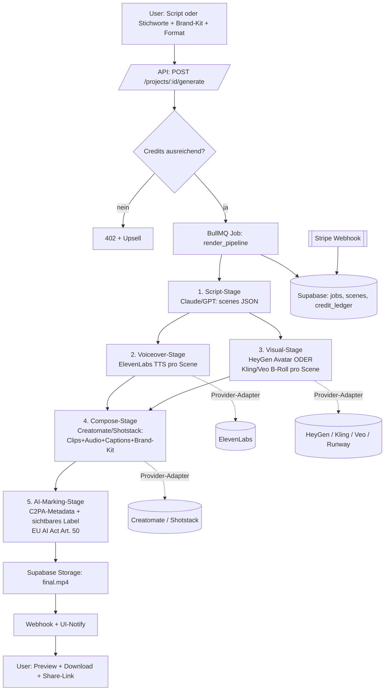

# SPEC — Video-Generation-SaaS

Technische Architektur. Modelle/APIs sind real (Stand Mai 2026, recherchiert — siehe Quellen unten). Prinzip: **dünner eigener Orchestrierungs-Layer über externen Generator-APIs**, model-agnostisch, kostengesteuert.

---

## 1. Empfohlener Stack

| Layer | Wahl | Begründung |
|---|---|---|
| Frontend | **Next.js (App Router) + Tailwind + shadcn/ui** | SSR, schnelles Dashboard, AEVUM-Standard |
| Backend/API | **Next.js Route Handlers + Node Worker** (oder NestJS bei Wachstum) | 1 Repo, einfacher Deploy |
| Job-Queue | **BullMQ + Redis** (Upstash) | Renders sind langlaufend/async — Queue ist Pflicht, kein Sync-Request |
| DB | **Supabase (Postgres + RLS + Storage + Auth)** | AEVUM-Standard, RLS für Mandanten-Trennung, Storage für Assets |
| Auth | **Supabase Auth** (Email + OAuth) | |
| Billing | **Stripe** (Checkout + Customer Portal + Usage/Credits) | self-serve, Webhooks → Credit-Wallet |
| Object-Storage | **Supabase Storage** / S3-kompatibel | Scripts, Renders, Brand-Assets |
| Hosting | **Vercel** (Web) + **separater Worker-Host** (Render/Railway/Fly für BullMQ) | Vercel-Functions ungeeignet für lange Renders |
| Observability | Sentry + strukturierte Logs + Job-Status-Tabelle | |

> Worker bewusst **getrennt von Vercel** (Serverless-Timeouts ungeeignet für minutenlange Render-Polls).

---

## 2. Externe Provider (real, recherchiert — austauschbar hinter Adaptern)

### Script-Generierung (Text→Script)
- **Claude (Anthropic) / GPT** — Script-Draft, Scene-Breakdown, Caption-Text. Strukturierter Output (JSON: scenes[], voiceover[], b_roll_prompts[]).

### Avatar / Talking-Head
- **HeyGen API** — Avatar-Video + TTS, 175+ Sprachen, Lip-Sync. API ab $5 Einstieg. Primär für „Presenter spricht Script".
- Alternativen-Slot: D-ID, Synthesia (Enterprise).

### Voiceover / TTS
- **ElevenLabs API** — Multilingual v2 (29+ Sprachen), 192kbps. Credit-Modell: V2-Multilingual = 1 credit/char; Flash/Turbo 0,5–1 credit/char. API Pro $99/mo. Voice-Cloning ab Creator-Tier (Consent-Gate, Phase 2).
- Kosten-Fallback-Slot: OpenAI TTS / Deepgram.

### B-Roll / generatives T2V
Model-agnostisch hinter Adapter, Wahl nach Kosten/Qualität pro Job:
- **Kling 3.0** — ~$0,10/sec, bestes Preis-Leistungs-Verhältnis → **Default-B-Roll**.
- **Google Veo 3.1** — $0,15/sec (fast) bis $0,75/sec (Standard, 4K + native Audio) → Premium-Tier.
- **Runway Gen-4.5** — ~$0,15/sec, beste kreative Steuerung.
- **OpenAI Sora 2** — $0,10/sec base, $0,30–0,50/sec Pro (⚠️ API laut Recherche nur bis ~Sep 2026 → nicht als alleinige Basis).
- **Stock-Fallback** — Pexels/Storyblocks-API wenn generativ zu teuer/zu langsam.

### Compositing / Render (Scenes → finales MP4)
- **Creatomate API** — JSON→Video, Template-Editor, ab $41/mo (144 min). **Default** (günstiger, visueller Editor für Brand-Templates).
- **Shotstack API** — JSON→Video, battle-tested, ab $49/mo (200 min @720p, sinkt bis $0,11/min). Alternative bei Skalierung.

> Render-Layer fügt zusammen: Avatar/B-Roll-Clips + Voiceover-Audio + Captions + Brand-Kit (Logo/Intro/Outro/Farben) → fertiges MP4 in Ziel-Format.

---

## 3. Datenfluss

**Stage-Prinzip:** jede Stage idempotent, eigener Status, retry-fähig. Asset-URLs (Voiceover-mp3, Scene-clips) werden zwischen Stages in `scenes` persistiert → Wiederaufnahme ohne kompletten Re-Render (Kostenschutz).

---

## 4. Kern-Endpoints (MVP)

| Method | Endpoint | Zweck |
|---|---|---|
| `POST` | `/api/auth/*` | Supabase Auth |
| `GET/POST` | `/api/workspaces` | Workspace + Member |
| `GET/PUT` | `/api/workspaces/:id/brand-kit` | Logo, Farben, Font, Intro/Outro, Caption-Style |
| `POST` | `/api/projects` | neues Video-Projekt |
| `POST` | `/api/projects/:id/script` | Script aus Stichworten generieren (Claude) → scenes-Draft |
| `PUT` | `/api/projects/:id/scenes` | Scenes editieren (Text, B-Roll-Prompt, Voice, Format) |
| `POST` | `/api/projects/:id/generate` | Render-Pipeline starten → Job (prüft Credits) |
| `GET` | `/api/jobs/:id` | Job-Status + Stage-Fortschritt (Polling/SSE) |
| `GET` | `/api/projects/:id/render` | finale MP4-URL + Share-Link |
| `GET` | `/api/credits` | Wallet-Stand + Ledger |
| `POST` | `/api/billing/checkout` | Stripe Checkout (Plan/Top-up) |
| `POST` | `/api/webhooks/stripe` | Credit-Gutschrift |
| `POST` | `/api/webhooks/providers/:provider` | async Provider-Callbacks (HeyGen/Render fertig) |

**Phase-2-Endpoints:** `POST /projects/:id/translate`, `POST /batch` (CSV), `POST /avatars` (Cloning + Consent), `POST /api-keys` (Headless-API), `GET /templates` (Marketplace).

---

## 5. Daten-Modell (Kern-Tabellen)

- `workspaces` (id, name, owner, plan)
- `workspace_members` (workspace_id, user_id, role)
- `brand_kits` (workspace_id, logo_url, colors jsonb, font, intro_url, outro_url, caption_style jsonb)
- `projects` (id, workspace_id, title, format, status, source_text)
- `scenes` (id, project_id, idx, text, voiceover_url, visual_provider, visual_url, b_roll_prompt, status)
- `jobs` (id, project_id, stage, status, provider_refs jsonb, cost_credits, error)
- `renders` (id, project_id, mp4_url, duration_sec, marking_applied bool)
- `credit_ledger` (workspace_id, delta, reason, stripe_ref, balance_after)
- `provider_costs` (job_id, provider, units, raw_cost_eur) — Margen-Tracking

Alle Tabellen: **RLS auf `workspace_id`** (Mandanten-Isolation).

---

## 6. Credit-/Kosten-Logik

Externe Kosten sind **per-second/per-char/per-render-minute**. Daher: **internes Credit-System** statt fixer Flat — schützt Marge.

- Pre-Flight-Schätzung vor `generate` (Scenes × geschätzte Sekunden × Provider-Rate) → Credit-Hold.
- Nach jedem Stage: realer Verbrauch in `provider_costs` → finale Abbuchung.
- Provider-Wahl pro Job nach Tier: Kling (günstig) für Lower-Tier, Veo/Runway (Premium) für höhere Pl
- Hard-Cap pro Workspace/Tag gegen Runaway-Kosten.

---

## 7. MVP-Scope vs. Phase-2 (kurz)

**MVP:** Script-Gen, Voiceover (ElevenLabs), B-Roll (Kling) **oder** Avatar (HeyGen, eine Variante reicht für Launch), Compose (Creatomate), Brand-Kit, 3 Format-Presets, Credits + Stripe, AI-Marking.

**Phase-2:** Translation/Multi-Sprache, Bulk/CSV, Avatar-/Voice-Cloning (+Consent), Public-API + Make/Zapier, Template-Marketplace, Premium-Modelle (Veo 4K), Team-Rollen/Approval-Flow.

---

## Quellen
- HeyGen API & Plattform: https://www.heygen.com/api-pricing , https://www.heygen.com/
- Model-Pricing (Sora2/Veo3.1/Kling3.0/Runway): https://www.buildmvpfast.com/api-costs/ai-video
- Model-Vergleich: https://lushbinary.com/blog/ai-video-generation-sora-veo-kling-seedance-comparison/
- ElevenLabs TTS-Pricing/Credits: https://elevenlabs.io/pricing/api , https://www.buildmvpfast.com/api-costs/ai-voice
- Creatomate vs Shotstack Render-APIs: https://samautomation.work/blog/best-video-apis-developers-2026/ , https://creatomate.com/developers
